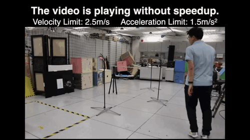
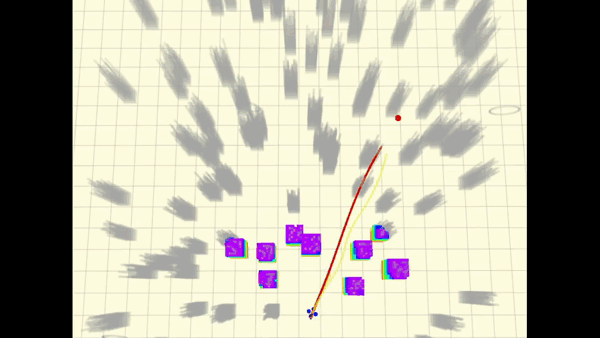

# Fast-Planner

## News

This package is under active maintenance. New features will be listed here.

- The implementation of the ICRA2020 paper: Robust Real-time UAV Replanning Using Guided Gradient-based Optimization and Topological Paths is integrated into this project. - April 12, 2020

- The online mapping algorithm is now available. It can take in depth image and camera pose pairs as input, do raycasting to update a probabilistic volumetric map, and build a Euclidean signed distance field (ESDF) for the planning system. - Jan 30, 2020

- The heading (yaw angle) planner which enables smoother change of heading direction is available. - Jan 11, 2020

## Overview

__Fast-Planner__ is a robust and efficient planning system that enables agile and fast autonomous flight for quadrotors.
It takes in information from odometry, sensor streams (such as depth images and point cloud), and outputs high-quality trajectories within a few milliseconds.
It can support aggressive and fully autonomous flight even in unknown and cluttered environments.
Currently it contains two distinctive planning architectures:
- __Kinodynamic search + B-spline trajectory optimization__:

<p align="center">
  
  
</p>

Demonstrations about the planner have been reported on the [IEEE Spectrum](https://spectrum.ieee.org/automaton/robotics/robotics-hardware/video-friday-nasa-lemur-robot).
Complete video is [here](https://www.youtube.com/watch?v=toGhoGYyoAY).

- __B-spline trajectory optimization guided by topological paths__:
<p align="center">
  
  
</p>

Complete video is [here](https://www.youtube.com/watch?v=YcEaFTjs-a0).


__Authors__: [Boyu Zhou](http://boyuzhou.net), [Fei Gao](https://ustfei.com/) and [Shaojie Shen](http://uav.ust.hk/group/) from the [HUKST Aerial Robotics Group](http://uav.ust.hk/).

### File Structure

This package contains the implementation of __Fast-Planner__ (in folder __fast_planner__) and a lightweight
quadrotor simulator (in __uav_simulator__). Key components of __fast_planner__ are:

- __plan_env__: The online mapping algorithms. It takes in depth image (or point cloud) and camera pose (odometry) pairs as input, do raycasting to update a probabilistic volumetric map, and build an Euclidean signed distance filed (ESDF) for the planning system. 
- __path_searching__: Front-end path searching algorithms. 
  Currently it includes a kinodynamic version of A* algorithm that respects the dynamics of quadrotors.
  It also contains a sampling-based topological path planning algorithm to generate multiple topologically distinctive paths that capture the structure of the 3D environments. 
- __bspline__: A implementation of the B-spline-based trajectory representation.
- __bspline_opt__: The gradient-based trajectory optimization using B-spline trajectory.
- __plan_manage__: High-level modules that schedule and call the mapping and planning algorithms. Interfaces for launching the whole system, as well as the configuration files are contained here.


## 1. Prerequisites

- Our software is developed and tested in Ubuntu 16.04, [ROS Kinetic](http://wiki.ros.org/kinetic/Installation/Ubuntu). Other version may require minor modification.

- We use [**NLopt**](https://nlopt.readthedocs.io/en/latest/NLopt_Installation) to solve the non-linear optimization problem.

- The __uav_simulator__ depends on the C++ linear algebra library __Armadillo__, which can be installed by ``` sudo apt-get install libarmadillo-dev ```.

- _Optional_: If you want to run the more realistic depth camera in __uav_simulator__, installation of [CUDA Toolkit](https://developer.nvidia.com/cuda-toolkit) is needed. Otherwise, a less realistic depth sensor model will be used (See section _Use GPU Depth Rendering_ below).

## 2. Build on ROS

After the prerequisites are satisfied, you can clone this repository to your catkin workspace and catkin_make. A new workspace is recommended:
```
  cd ${YOUR_WORKSPACE_PATH}/src
  git clone https://github.com/HKUST-Aerial-Robotics/Fast-Planner.git
  cd ../
  catkin_make
```

### Use GPU Depth Rendering (Optional)

 The **local_sensing** package in __uav_simulator__ has the option of using GPU or CPU to render the depth sensor measurement. By default, it is set to CPU version in CMakeLists:
 
 ```
 set(ENABLE_CUDA false)
 # set(ENABLE_CUDA true)
 ```
However, we STRONGLY recommend the GPU version, because it generates depth images more like a real depth camera.
To enable the GPU depth rendering, set ENABLE_CUDA to true, and also remember to change the 'arch' and 'code' flags according to your graphics card devices. You can check the right code [here](https://github.com/tpruvot/ccminer/wiki/Compatibility).

```
    set(CUDA_NVCC_FLAGS 
      -gencode arch=compute_61,code=sm_61;
    ) 
``` 
For installation of CUDA, please go to [CUDA ToolKit](https://developer.nvidia.com/cuda-toolkit)

## 3. Run the Simulation

Run [Rviz](http://wiki.ros.org/rviz) with our configuration firstly:

```
  <!-- go to your workspace and run: -->
  source devel/setup.bash
  roslaunch plan_manage rviz.launch
```

Then run the quadrotor simulator and __Fast-Planner__.
Currently there are two different planning algorithms available, as listed in the following: 

### 3.1 Kinodynamic Search & B-spline Optimization

In this method, a kinodynamic path searching finds a safe, dynamically feasible, and minimum-time initial trajectory in the discretized control space. 
Then the smoothness and clearance of the trajectory are improved by a B-spline optimization.
To test this method, run:

```
  <!-- open a new terminal, go to your workspace and run: -->
  source devel/setup.bash
  roslaunch plan_manage kino_replan.launch
```

Normally, you will find the randomly generated map and the drone model in ```Rviz```. At this time, you can trigger the planner using the ```2D Nav Goal``` tool. When a point is clicked in ```Rviz```, a new trajectory will be generated immediately and executed by the drone. A sample is displayed below:

<!-- add some gif here -->
 <p align="center">
  
 </p>

If you use this algorithm for your application or research, please cite our related paper:

- [__Robust and Efficient Quadrotor Trajectory Generation for Fast Autonomous Flight__](https://ieeexplore.ieee.org/document/8758904), Boyu Zhou, Fei Gao, Luqi Wang, Chuhao Liu and Shaojie Shen, IEEE Robotics and Automation Letters (RA-L), 2019.
```
@article{zhou2019robust,
  title={Robust and efficient quadrotor trajectory generation for fast autonomous flight},
  author={Zhou, Boyu and Gao, Fei and Wang, Luqi and Liu, Chuhao and Shen, Shaojie},
  journal={IEEE Robotics and Automation Letters},
  volume={4},
  number={4},
  pages={3529--3536},
  year={2019},
  publisher={IEEE}
}
```

### 3.2 Trajectory optimization guided by topological paths

The key feature of the algorithm is that it searches for multiple trajectories in distinctive topological classes. Thanks to the strategy, the solution space is explored more thoroughly, avoiding local minima and yielding better replanned trajectories.
Similarly, run:

```
  <!-- open a new terminal, go to your workspace and run: -->
  source devel/setup.bash
  roslaunch plan_manage topo_replan.launch
```

then you will find the random map generated and can use the ```2D Nav Goal``` to trigger the planner:

<!-- add some gif here -->
 <p align="center">
  
 </p>

If you use this algorithm for your application or research, please cite our related paper:

- [__Robust Real-time UAV Replanning Using Guided Gradient-based Optimization and Topological Paths__](https://arxiv.org/abs/1912.12644), Boyu Zhou, Fei Gao, Jie Pan and Shaojie Shen, submitted to IEEE International Conference on Robotics and Automation (__ICRA__), 2020.

```
@article{zhou2019robust,
  title={Robust Real-time UAV Replanning Using Guided Gradient-based Optimization and Topological Paths},
  author={Zhou, Boyu and Gao, Fei and Pan, Jie and Shen, Shaojie},
  journal={arXiv preprint arXiv:1912.12644},
  year={2019}
}
```

## 4. Use in Your Application

If you have successfully run the simulation and want to use __Fast-Planner__ in your project,
please explore the files kino_replan.launch or topo_replan.launch.
Important parameters that may be changed in your usage are contained and documented.

Note that in our configuration, the size of depth image is 640x480. 
For higher map fusion efficiency we do downsampling (in kino_algorithm.xml, skip_pixel = 2).
If you use depth images with lower resolution (like 256x144), you might disable the downsampling by setting skip_pixel = 1. Also, the _depth_scaling_factor_ is set to 1000, which may need to be changed according to your device.

Finally, please kindly give a STAR to this repo if it helps your research or work, thanks! :)

## 5. Acknowledgements
  We use **NLopt** for non-linear optimization.

## 6. Licence
The source code is released under [GPLv3](http://www.gnu.org/licenses/) license.


## 7. Disclaimer
This is research code, it is distributed in the hope that it will be useful, but WITHOUT ANY WARRANTY; without even the implied warranty of merchantability or fitness for a particular purpose.
