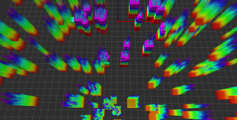

# Fast-Planner

__Fast-Planner__ is a quadrotor trajectory generator for fast autonomous flight. It consists of 
the front-end _kinodynamic path searching_, the back-end _gradient-based Bspline trajectory optimization_ and the postprocessing named as _iterative time adjustment_. The key features of the planner are that it generates
high-quality trajectories within a few milliseconds and that it can generate aggressive motion under the premise of dynamic feasibility. For more details, we refer the users to the related paper and video:

- __Robust and Efficient Quadrotor Trajectory Generation for Fast Autonomous Flight__, Boyu Zhou, Fei Gao, Luqi Wang, Chuhao Liu and Shaojie Shen, IEEE Robotics and Automation Letters (RA-L), 2019.
<p align="center">
  <a href="https://youtu.be/XxBw2nmL8t0" target="_blank"></a>
</p>

<!-- add some gif of the paper video: -->
<p align="center">
  
</p>

<p align="center">
  
</p>

__Authors__: [Boyu Zhou](https://github.com/ZbyLGsc), [Fei Gao](https://ustfei.com/) and [Shaojie Shen](http://uav.ust.hk/group/) from the [HUKST Aerial Robotics Group](http://uav.ust.hk/).

This package contains the implementation of __Fast-Planner__ (in folder __dyn_planner__) and a light weight
quadrotor simulator (in __uav_simulator__).

If you use __Fast-Planner__ for your application or research, please cite our related papers.

## 1. Prerequisites

- Our software is developed in Ubuntu 16.04, [ROS Kinetic](http://wiki.ros.org/kinetic/Installation/Ubuntu).

- We use [**NLopt**](https://nlopt.readthedocs.io/en/latest/NLopt_Installation) to solve the non-linear optimization problem.

## 2. Build on ROS

Clone this repository to your catkin workspace and catkin_make. A new workspace is recommended:
```
  cd ${YOUR_WORKSPACE_PATH}/src
  git clone https://github.com/HKUST-Aerial-Robotics/Fast-Planner.git
  cd ../
  catkin_make
```

## 3. Run the Simulation

Run [Rviz](http://wiki.ros.org/rviz) with our configuration firstly:

```
  <!-- go to your workspace and run: -->
  source devel/setup.bash
  roslaunch plan_manage rviz.launch
```

Then run the quadrotor simulator and __Fast-Planner__:

```
  <!-- open a new terminal, go to your workspace and run: -->
  source devel/setup.bash
  roslaunch plan_manage simulation.launch
```

Normally, you will find the randomly generated map and the drone model in ```Rviz```. At this time, you can select a goal for the drone using the ```3D Nav Goal```(__click__ and __hold__ both the left and right mouse buttons to select _(x,y)_, and __move__ the mouse to change _z_). When a goal is set, a new trajectory will be generated immediately and executed by the drone, as displayed below:

<!-- add some gif here -->
 <p align="center">
  
 </p>

## 4. Acknowledgements
  We use **NLopt** for non-linear optimization.

## 5. Licence
The source code is released under [GPLv3](http://www.gnu.org/licenses/) license.


## 6. Disclaimer
This is research code, it is distributed in the hope that it will be useful, but WITHOUT ANY WARRANTY; without even the implied warranty of merchantability or fitness for a particular purpose.